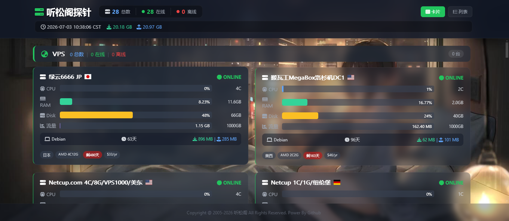
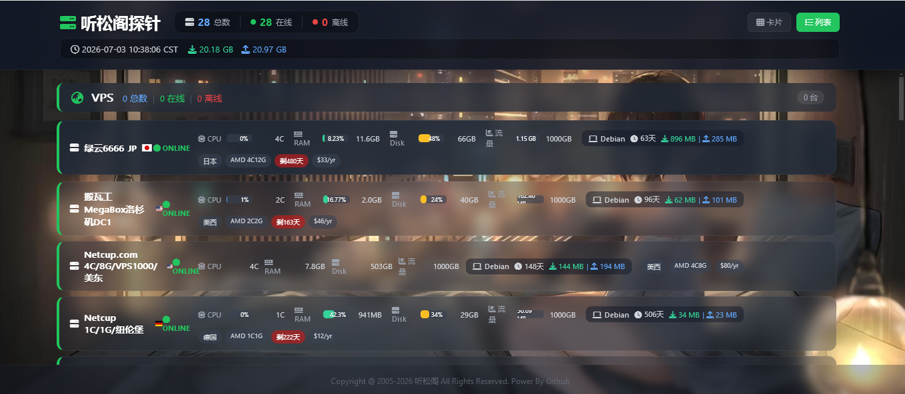
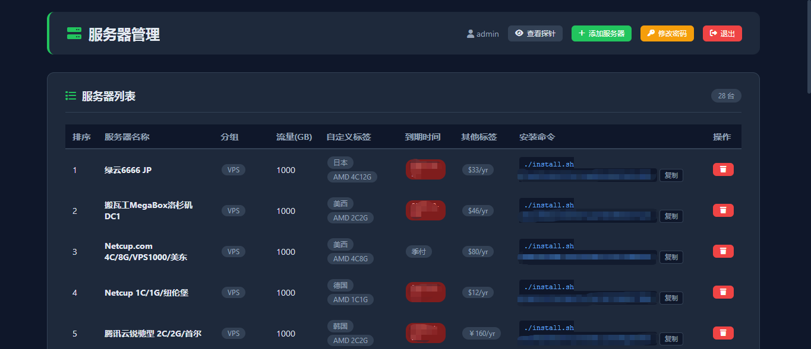
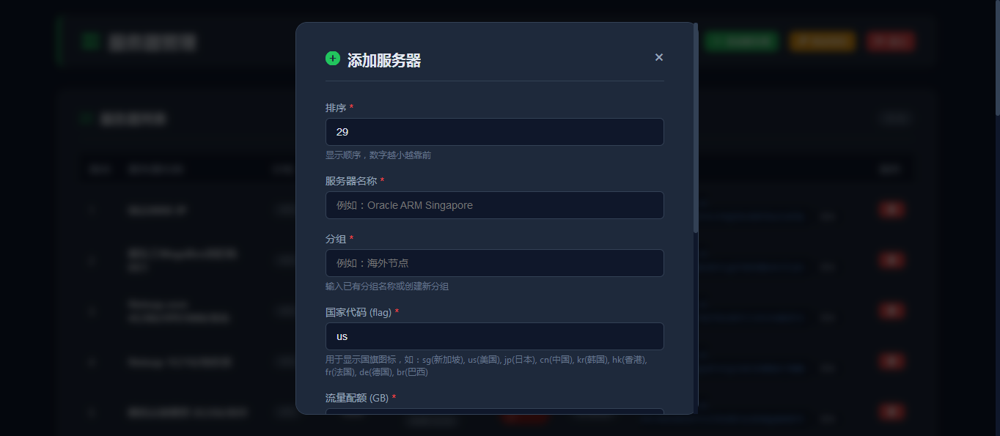

# php server monitor

 

  <h2 align="center" style="font-weight: 600">PHP Server Monitor</h2>

  

    PHP开发的开单服务器探针
     
    <a href="/简洁版/README.md"><strong>简洁版安装说明</strong></a>&nbsp;&nbsp;|&nbsp;&nbsp;
    <a href="/配置文件版/README.md"><strong>配置文件版安装说明</strong></a>&nbsp;&nbsp;
     
     
  

php server monitor 是一款轻量级、高性能的服务器状态监控系统，专为多服务器管理场景设计。通过简单的客户端安装，即可实现对所有服务器的CPU、内存、磁盘、网络流量、延迟等核心指标的实时监控与可视化展示。

### ✨ 功能概览

- **install.sh文件**:  在被监控机上报CPU/内存/硬盘和PING等基本信息。
- **report.php文件**:  在主控机上负责接收信息转成sqlite。
- **index.php文件**: 负责渲染网页。

### ✨ 核心优势

### 1. 轻量高效，资源占用极低

- 服务端基于PHP + SQLite，无需MySQL等重型数据库
- 客户端Shell脚本，内存占用仅几MB
- 单台服务器即可管理数百台节点
- 适合从个人VPS到企业级集群的各类场景

### 2. 多服务器统一管理

- 支持无限台服务器的集中监控
- 服务器按分组管理（VPS、甲骨文ARM/AMD、Azure、自定义分组等）
- 每个分组独立统计在线/离线数量
- 一眼掌握所有服务器状态

## 3. 实时数据展示

- 每30秒自动刷新数据
- 实时显示CPU使用率、内存占用、磁盘使用率
- 月流量统计与进度条展示
- 在线/离线状态实时更新

### 4. 灵活的标签系统

- 自定义标签：地理位置、配置规格
- 到期时间标签：自动计算剩余天数
- 价格/带宽标签：方便成本管理
- 支持到期提醒（已过期/今日到期/剩X天）

### 6. 智能客户端安装

- 一键安装脚本，无需复杂配置
- 自动创建systemd服务，开机自启
- 支持Token认证，安全可靠
- 安装后自动上报数据，无需人工干预

## 7. 完整的后台管理系统

- 可视化添加/删除服务器
- 自动生成32位随机Token
- 支持自定义排序
- 配置修改自动备份

### 8. 优雅的用户界面

- 毛玻璃效果，现代化UI设计
- 支持卡片/列表两种视图模式
- 固定背景，滚动内容，沉浸式体验
- 响应式设计，完美适配PC/平板/手机

### 9. 数据持久化存储

- SQLite数据库存储历史数据
- 24小时历史数据自动清理
- 月度流量累计统计
- 配置JSON文件存储，便于迁移和备份

### 10. 安全可靠

- Token认证机制，防止非法上报
- 管理员密码MD5加密存储
- 配置文件自动备份
- 低权限用户运行客户端

### 🎯 适用场景

- 个人VPS管理，集中管理多台VPS，一目了然查看所有服务器状态
- IDC机房监控，监控机房内所有服务器的运行状态
- 云资源管理，管理AWS、Azure、GCP、阿里云等多云资源
- 运维团队，团队协作，统一监控所有服务器
- 服务器探针，替代传统的ServerStatus等探针工具
- 成本管理，通过标签记录服务器价格、到期时间，方便成本核算

### 🚀 技术亮点

#### 服务端
- PHP 7.4+：主流PHP版本支持
- SQLite 3：零配置，高性能，无需额外数据库服务
- Chart.js：前端图表库，延迟趋势图可视化
- JSON配置：配置与代码分离，便于维护

#### 客户端
- Bash Shell：兼容主流Linux发行版
- systemd：开机自启，进程守护
- 轻量级采集：使用vmstat、free、df等系统命令，资源占用极小

### 📦 功能清单

#### 监控指标
- CPU使用率	实时百分比
- 内存使用率	实时百分比 + 总量
- 磁盘使用率	实时百分比 + 总量
- 网络流量	月累计RX/TX流量
- 延迟检测	移动/联通/电信/ATT
- 系统信息	操作系统、内核版本
- 运行时长	服务器在线天数/小时
#### 管理功能
- 服务器管理	添加/删除/排序
- 分组管理	自定义分组，分组统计
- Token管理	自动生成32位Token
- 标签管理	自定义标签、到期时间、价格标签
- 密码管理	管理员密码修改
- 配置备份	自动备份配置文件
#### 客户端功能
- 一键安装	自动化安装脚本
- 系统服务	systemd服务管理
- 自动上报	定时上报数据（默认120秒）
- 网络测试	多运营商延迟检测
- 开机自启	自动启动

### 🌟 开源协议

本系统基于 MIT License 开源，欢迎使用、修改、分发。

- ✅ 商业使用
- ✅ 修改源代码
- ✅ 分发副本
- ✅ 私用

### 📞 联系方式

- 演示地址：https://vps.hhhnn.com/
- GitHub：https://github.com/kylehao/php-server-monitor
- 问题反馈：提交Issue或Pull Request

### 参考资料
基于Nodeseek的代码优化
https://www.nodeseek.com/post-782019-1

---

Enjoy your php server monitor! 🚀
